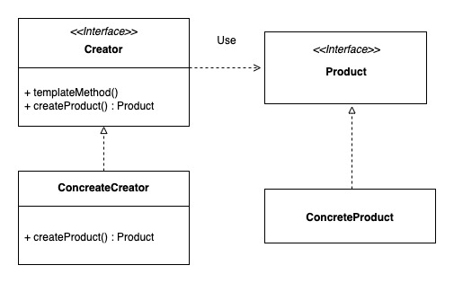

# item 5. 자원을 직접 명시하지 말고 의존 객체 주입을 사용하라

* 이 패턴의 쓸만한 변형으로 생성자에 자원 팩터리를 넘겨주는 방식이 있다.
* 자바 8에서 소개한 `Supplier<T> 인터페이스`가 팩터리를 표현한 완벽한 예다.
* `한정적 와일드카드 타입`을 사용해 팩터리의 타입 매개변수를 제한해야 한다.
* 의존 객체가 많은 경우에 Dagger, Guice, 스프링 같은 의존 객체 주입 프레임워크 도입을 고려할 수 있다.

## 팩토리 메서드 패턴
>구체적으로 어떤 인스턴스를 만들지는 서브클래스가 정한다.

* 새로운 Product를 제공하는 팩토리를 추가하더라도, 팩토리를 사용하는 클라이언트 코드는 변경할 필요가 없다.

* 구체적인 인스턴스를 팩토리 클래스에서 만들어주는 것..

## 스프링 IoC
BeanFactory 또는 ApplicationContext
* Inversion of Control - 뒤짚힌 제어권(제어의 역전)
  * 자기 코드에 대한 제어권을 자기 자신이 가지고 있지 않고 외부에서 제어하는 경우.
  * 제어권? 인스턴스를 만들 거나, 어떤 메소드를 실행하거나, 필요로 하는 의존성을 주입받는 등..
* 스프링 IoC 컨테이너 사용 장점
  * 수많은 개발자에게 검증되었으며 자바 표준스펙(@Inject)도 지원한다.
  * 손쉽게 싱글톤 Scope를 사용할 수 있다.(인스턴스를 싱글톤 scope으로 사용하기 쉽다.)
  * 객체 생성(Bean) 관련 라이프사이클 인터페이스를 제공한다.
> 자바 서블릿 -> doGet, doPost override해서 정의해놓는다. 
> `BUT` 두 메서드를 우리가 직접 호출하지 않고 서블릿 컨테이너가 호출한다. 
> 두 메세지를 호출하는 제어권이 컨테이너에 있다.
