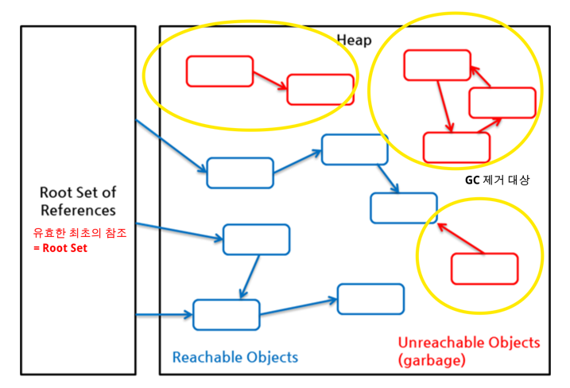

# 아이템7. 다 쓴 객체 참조를 해제하라.
* 어떤 객체에 대한 래퍼런스가 남아 있다면 해당 객체는 가비지 컬렉션의 대상이 되지 않는다.
* 자기 메모리를 직접 관리하는 클래스라면 메모리 누수에 주의해야 한다.
  * 예) 스택, 캐시, 리스너 또는 콜백
  * 참조 객체를 null 처리하는 일은 예욎거인 경우이며 가장 좋은 방법은 유효 범위 밖으로 밀어내는 것이다. 

  -> 객체를 쌓아두는 공간이 있음. 객체들이 계속해서 쌓임
  -> 그걸 어떻게 정리할 것인가?
* stack -> 빼낼 때 직접 null을 해준다. 
* cache 에서 -> weakHashMap 
weakReperence를 key로 가지는 map 
-> 더이상 참조가 안되는 key가 있으면 gc가 날림 
## 완벽공략
* p37. NullPoionterException
* p38. WeakHashMap
  * p.38, 약한 참조(weak reference)
* p39, 백그라운드 쓰레드
  * p39, ScheduledThredadPoolExecuter
  
## 완벽공략 - WeakHashMap
더이상 사용하지 않는 객체를 GC할때 자동으로 삭제해주는 Map
* key가 더이상 `강하게 래퍼런스되는 곳`이 없다면 해당 엔트리를 제거한다
* 래퍼런스 종류
  * Strong, `Soft`, `Weak`, `Phantom` 
  * Reference 클래스를 애플리케이션에 사용하면 GC에 일정 부분 관여할 수 있고, LRU(Least Recently Used) 캐시 같이 특별한 작업을 하는 애플리케이션을 더 쉽게 작성할 수 있습니다.
* 맵의 엔트리를 맵의 Value가 아니라 key에 의존해야 하는 경우에 사용할 수 있다.
* 캐시를 구현하는데 사용할 수 있지만, 캐시를 직접 구현하는 것은 권장하지 않는다.


# Java Reference와 GC
## GC와 Reachability
Java GC는 객체가 가비지인지 판별하기 위해서 reachability라는 개념을 사용한다. 
* 어떤 객체에 유효한 참조가 있으면 `reachable`
* 없으면 `unreachable`

-> `unreachable` 객체를 가비지로 간주해 GC를 수행한다. 

객체가 유효한 참조인지 확인하려면 유효한 최초의 참조를 확인해야 하는데 이것을 `객체 참조의 root set` 이라고 한다.
힙에 있는 객체들에 대한 참조는 다음 4가지 종류 중 하나이다.

* 힙 내의 다른 객체에 의한 참조
* Java 스택, 즉 Java 메서드 실행 시에 사용하는 지역 변수와 파라미터들에 의한 참조
* 네이티브 스택, 즉 JNI(Java Native Interface)에 의해 생성된 객체에 대한 참조
* 메서드 영역의 정적 변수에 의한 참조
이들 중 힙 내의 다른 객체에 의한 참조를 제외한 나머지 3개가 root set으로, reachability를 판가름하는 기준이 된다.

이 그림에서 참조는 모두 java.lang.ref 패키지를 사용하지 않은 일반적인 참조이며, 이를 흔히 strong reference라 부른다.

## Soft, Weak, Phantom Reference
java.lang.ref 패키지는 전형적인 객체 참조인 strong reference 외에도 soft, weak, phantom 3가지의 새로운 참조 방식을 각각의 Reference 클래스로 제공합니다.
**이 3가지 Reference 클래스를 애플리케이션에 사용하면 GC에 일정 부분 관여할 수 있고,** LRU(Least Recently Used) 캐시 같이 특별한 작업을 하는 애플리케이션을 더 쉽게 작성할 수 있습니다.

### WeakReference
```java
        MyClass myClass = new MyClass();
        //strong 변수가 참조를 가지고 있는 한, Object 객체는 GC의 대상이 되지 않습니다.
        WeakReference<MyClass> weakReference = new WeakReference<>(myClass); //reference object
        myClass = null; //myClass의 기존 객체에 접근할 수 없도록 Unreachable Object로 변경
        
        System.gc();
        Thread.sleep(3000L);
		
        System.out.println("weak = " +  weakReference.get()); // referent
```
>계속 헷갈렸는데.. weakReference 가 아니라 myClass Null 해주면 weakReference가 삭제됨.<br>
-> 기존 객체에 접근할 수 없기 때문에(null) weakReference가 삭제됨. <br>
> strong ref는 null을 해야만 gc가 삭제. <br> 
> weak Ref는 기존 객체에 접근할 수 없고 WeakReference만 존재하는 경우 삭제 대상

대상 객체(myClass)를 참조하는 경우가 WeakReference 객체만 존재하는 경우 GC 대상이 되며 다음 GC 실행 시 무조건 힙 영역에서 제거된다.

### SoftReference
```java
		MyClass strong = new MyClass();
        SoftReference<MyClass> soft = new SoftReference<>(strong);
        strong = null;

        System.gc();
        Thread.sleep(3000L);

        // TODO 거의 안 없어집니다.
        //  왜냐면 메모리가 충분해서.. 굳이 제거할 필요가 없으니까요.
        System.out.println(soft.get());
```
```text
> Task :SoftReferenceExample.main()
java.lang.Object@515f550a
```
원래는 strong Null 값을 할당하였기 때문에 GC를 수행하면 제거되어야 하지만 Soft Reference 유형이기 때문에 JVM 메모리가 넉넉하므로 Soft Reference인 soft 제거되지 않은 것을 확인할 수 있다.
SoftReference의 경우 memory가 부족할 경우 삭제함.
`get()` 메서드는 자신이 참조하고 있는 객체를 반환하는 메서드로 여기선 MyClass 타입인 strong을 반환한다. 만약 GC에 의해 제거되었다면 null을 반환한다.